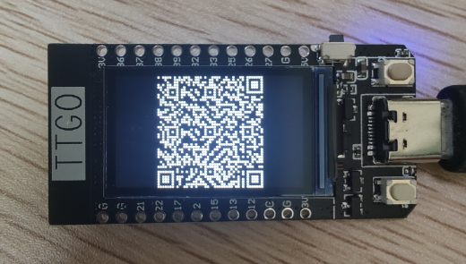

# esp32-qrcode
> esp32 qrcode sample

## 效果

## ESP32开发板

TTGO-T-Display

**开发板驱动**

https://www.silabs.com/documents/public/software/CP210x_Universal_Windows_Driver.zip

## 依赖包

bodmer/TFT_eSPI@2.0.0  https://github.com/Bodmer/TFT_eSPI

这个包的版本已经无法自动下载了，已放在assets文件夹下

使用方法: 把TFT_eSPI@2.0.0.7z解压到你的 %USERPROFILE%/.platformio/lib 目录下即可

